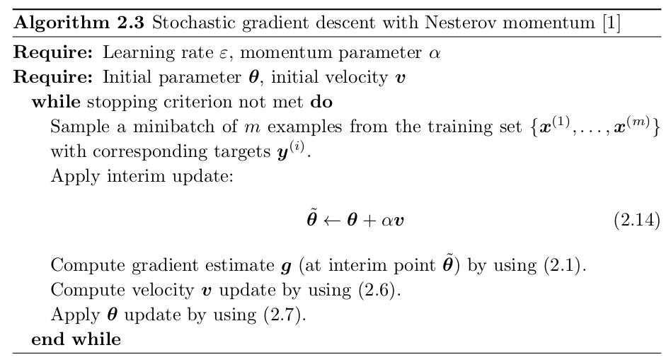

# Optimization for ML
この資料では，Deep model で用いられることの多い最適化について， [^1] を参考にしながら簡単にまとめる．

[^1]: I.Goodfellow, et al., [Deep Learning](https://www.deeplearningbook.org/), MIT Press, 2016.

#### 内容
- Stochastic Gradient Descent の気持ち
- 基本的なアルゴリズム
    - Stochastic Gradient Descent
    - Momentum
    - Nesterov Momentum
- 実用的なアルゴリズム
    - AdaGrad
    - RMSProp
    - Adam

## 1. Stochastic Gradient Descent の気持ち
この節は，[^1] Chapter 5.9 を参考にした．

ほとんどの deep learning は，**stochastic gradient descent** (SGD) に支えられている．SGD は，最急降下法の拡張である．

機械学習で繰り返し生じる問題

- Large training sets
    - 精度の良い一般化のためには必要．
    - 計算コストがかかる．

機械学習に用いられるコスト関数は，しばしば example ごとの loss function の training examples の和に分解できる．
e.g. training data の negative conditional log-likelihood

$$ J(\boldsymbol{\theta}) = \mathbb{E}_{\boldsymbol{x}, y \sim \hat{p}_{\text{data}}} L(\boldsymbol{x}, y, \boldsymbol{\theta}) = \frac{1}{m} \sum_{i = 1}^m L(\boldsymbol{x}^{(i)}, y^{(i)}, \boldsymbol{\theta}), \tag{1.1}$$

where $L$ is the per-example loss $L(\boldsymbol{x}, y, \boldsymbol{\theta}) = -\log p(y | \boldsymbol{x}; \boldsymbol{\theta}).$

- $L$: 損失関数
- $\boldsymbol{x}$: 入力
- $y$: 出力 (教師あり学習の場合)
- $\boldsymbol{\theta}$: パラメータ
- $f(\boldsymbol{x}; \boldsymbol{\theta})$: 出力の予測
- $\hat{p}_{\text{data}}$: 経験分布

このような和の形で記述されたコスト関数に対して，gradient descent は以下を計算する必要がある．

$$ \nabla_{\boldsymbol{\theta}} J(\boldsymbol{\theta}) = \frac{1}{m} \nabla_{\boldsymbol{\theta}} L(\boldsymbol{x}^{(i)}, y^{(i)}, \boldsymbol{\theta}). \tag{1.2}$$

この計算は，$O(m)$ である．つまり，すべてのサンプルを勾配の計算に用いる gradient descent では，training set のサイズに比例して勾配計算にかかる時間が長くなる．

SGD では，gradient が期待値であると考える．期待値は examples の small set を用いて近似的に推定される．具体的には，アルゴリズムの各ステップで，training set から独立に **minibatch** of examples $\mathbb{B} = \{\boldsymbol{x}^{(1)}, \ldots, \boldsymbol{x}^{(m^{\prime})}\}$ をサンプルできるとする．

- minibatch size $m^{\prime}$ は通常 examples の数よりも比較的小さく，1から数百の範囲で選ばれる．
- $m^{\prime}$ は，training set size $m$ が増加しても一定の値であることが重要． 
    - training set のサイズが billions であっても，更新は数百程度の examples を使う．

gradient の 推定量は，minibatch $\mathbb{B}$ からの examples を用いて

$$ \boldsymbol{g} = \frac{1}{m^{\prime}} \nabla_{\boldsymbol{\theta}} \sum_{i = 1}^{m^{\prime}} L(\boldsymbol{x}^{(i)}, y^{(i)}, \boldsymbol{\theta}) \tag{1.3}$$

という形をしている．SGD は，勾配の推定値を用いて $\boldsymbol{\theta}$ を以下のように更新する．

$$\boldsymbol{\theta} \leftarrow \boldsymbol{\theta} - \varepsilon \boldsymbol{g}, \tag{1.4}$$

where $\varepsilon$ is the learning rate.

SGDは deep learning の文脈の外でも重要である．

- SGD の update は training set のサイズ $m$ に依存しない．
- update が $O(1)$ である．

## 2. 基本的なアルゴリズム
この節は，[^1] Chapter 8.3 を参考にした．

### 2.1. Stochastic Gradient Descent
SGD およびその改良版は，機械学習で一般的に，特に deep learning で用いられる最適化手法である．
Data-generating distribution からの i.i.d sampling によって $m$ examples の minibatch の gradient の平均をとると，gradient の不偏推定量を得ることができる([^1], Chapter 8.1.3)．

Algorithm 2.1 に SGD の更新則を示す (1節の $m^{\prime}$ を $m$ と思う)．
アルゴリズムを見るとわかるが，steepest descent との違いは勾配を求めるときにすべてのデータを用いるのではなく，ランダムに選んだ $m$ 個の examples からなる minibatch を用いるという点である．

SGD において重要なアルゴリズムは，learning rate である．実用的には，徐々に learning rate を減らしていくことが必要であるので，iteration $k$ における learning rate を $\varepsilon_k$ と書いている．

- SGD gradient estimator は，$m$ 個の training examples の random sampling によって noise を生じる．
- このノイズは極小値に到達してもなくならない．
- 一方で， batch gradient descent を使うと，total cost function の真の gradient は小さくなり，極小に近づく (到達する) と $\boldsymbol{0}$ になる．
    - よって，batch gradient descent では fixed learning rate を使うことができる．

SGD の収束性を保証する十分条件は，

$$ \sum_{k = 1}^{\infty} \varepsilon_k = \infty, \tag{2.3}
$$$$\sum_{k = 1}^{\infty} \varepsilon_k^2 < \infty \tag{2.4}$$

である[^1]．

実用的には，iteration $\tau$ まで学習率を線形に減衰させるのが一般的である:

$$ \varepsilon_k = (1 - \alpha) \varepsilon_0 + \alpha \varepsilon_{\tau} \tag{2.5}$$

with $\alpha = k/\tau$. Iteration $\tau$ の後は，$\varepsilon$ を一定にする．

Learning rate は試行錯誤的に選ばれるが，最も良い選び方は学習曲線を monitoring して，時間の関数として objective function をプロットすることと言われている．
$\rightsquigarrow$ これは人工的なものであり，懐疑的に見る必要はある．

Linear schedule を使う場合，パラメータは $\varepsilon_0, \varepsilon_{\tau}, \tau$.

- $\tau$ は，training set を数百回通過するのに必要な iteration の数とするのが一般的．
- $\varepsilon_{\tau}$ は，$\varepsilon_0$ の 1% 程度にするのが一般的．

$\rightsquigarrow$ Main question は，どのように $\varepsilon_0$ を選ぶかということ．

- 大きすぎると学習曲線が振動する．
- 小さすぎると学習に時間がかかる．

一般に，total training time や final cost value の観点での optimal initial rate は，最初の100 iterations 後で最適な performance を与える learning rate より高い．
$\rightsquigarrow$ 最初の数百回の iterations をモニターして，そのとき最も良い performance を与えた学習率よりも大きいものを選ぶのが良い．ただし，大きくしすぎると学習が不安定になりうる．

SGD や関連する minibatch or online gradient-based optimization の重要な特徴

- 更新にかかる計算時間が training examples の増加に依らない

$\rightsquigarrow$ training examples が増加しても収束する．

最適化アルゴリズムの収束率は，**excess error** $J(\boldsymbol{\theta}) - \min_{\boldsymbol{\theta}} J(\boldsymbol{\theta})$ を用いて測ることが多い．

- SGD を凸計画問題に適用した場合，$k$ 回の iteration の後の excess error は，$O(1/\sqrt{k})$．強凸の場合，$O(1/k)$.
    - この下限は，extra conditions を仮定しないと改善されない．

### 2.2 Momentum SGD
SGD は収束が遅かったり，振動したりといった問題が起こりうる．

- Hessian matrix の poor condition
- stochastic gradient の分散

$\rightsquigarrow$ モーメンタム法は，過去の勾配の情報を割り引いて取り入れることで振動を抑制．学習の高速化を図る．

モーメンタム法

- 物理のアナロジーに由来．
    - パラメータ空間を粒子が negative gradient を力として運動している．

以下の記号を導入．

- $\boldsymbol{v}$: 速度
- $\alpha \in [0, \ 1)$: 過去の勾配の寄与が指数関数的に減衰する速さを決定するハイパーパラメータ

Algorithm 2.2 にモーメンタムの更新則を示す．

- $\boldsymbol{v}$ は過去の勾配 $\boldsymbol{g}$ の累積になっている．
- $\alpha$ は $\varepsilon$ と比べてどのくらい過去の勾配を重視するかを決める．
- ステップの幅は，勾配の大きさと一連の勾配がどのように整列しているかに依る．
    - 多くの勾配が同じ方向を向いていれば，step size は大きい．
- モーメンタム法では常に勾配 $\boldsymbol{g}$ を観測し，terminal velocity に達するまで $-\boldsymbol{g}$ 方向に加速し続ける．Terminal velocity に達したときのステップ幅は，
$$ \frac{\varepsilon \|\boldsymbol{g} \|}{1 - \alpha} \tag{2.8}$$

- $\alpha = 0.5, 0.9, 0.99$ などがよく使われる．$\alpha$ を adaptive にすることは学習率の調整ほど重要ではない．
- $\varepsilon$ は $0.01$ などにしているのが多そう．

$n$ 回目の更新時における $\boldsymbol{v}$, $\boldsymbol{\theta}$ を，$\boldsymbol{v}_n$, $\boldsymbol{\theta}_n$ と書く．(2.7)の更新式は $\boldsymbol{v}$ が含まれない形で書き直すことができることに注意する．

$$ \begin{cases} \boldsymbol{\theta}_{n + 1} - \boldsymbol{\theta}_n = \boldsymbol{v}_n \\ \boldsymbol{v}_n = \alpha \boldsymbol{v}_{n - 1} - \varepsilon \boldsymbol{g}  \end{cases} \Longleftrightarrow \boldsymbol{\theta}_{n + 1} - \boldsymbol{\theta}_n = - \varepsilon \boldsymbol{g} + \alpha (\boldsymbol{\theta}_n - \boldsymbol{\theta}_{n - 1}) \tag{2.9}$$

ここで，モーメンタム法の物理的なアナロジーについて簡単にまとめる．

質量 $m$ の粒子の時刻 $t$ での位置が $\boldsymbol{\theta}(t)$ で与えられるとし，粒子に対して速度に比例する摩擦力 ($\mu$を比例定数とする) と位置エネルギー $E(\boldsymbol{\theta})$ からの力が作用しているとする．このとき，ニュートンの運動方程式は，

$$ m \frac{d^2 \boldsymbol{\theta}}{dt^2} + \mu \frac{d \boldsymbol{\theta}}{dt} = - \nabla_{\boldsymbol{\theta}} E(\boldsymbol{\theta}) \tag{2.10}$$

となる．オイラー法を用いると，以下の離散時間のダイナミクスを得る．

$$ m \frac{\boldsymbol{\theta}_{n + 1} - 2\boldsymbol{\theta}_n + \boldsymbol{\theta}_{n - 1} }{(\Delta t)^2} + \mu \frac{\boldsymbol{\theta}_{n} - \boldsymbol{\theta}_{n - 1}}{\Delta t} = - \nabla_{\boldsymbol{\theta}} E(\boldsymbol{\theta}) \tag{2.11}$$

(2.11) を整理すると，

$$ \boldsymbol{\theta}_{n + 1} - \boldsymbol{\theta}_n = - \frac{(\Delta t)^2}{m + \mu \Delta t} \nabla_{\boldsymbol{\theta}} E(\boldsymbol{\theta}) + \frac{m}{m + \mu \Delta t} (\boldsymbol{\theta}_{n} - \boldsymbol{\theta}_{n - 1}) \tag{2.12}$$

を得る．

$$ \varepsilon \coloneqq \frac{(\Delta t)^2}{m + \mu \Delta t}, \ \ \alpha \coloneqq \frac{m}{m + \mu \Delta t} \tag{2.13}$$

とすると，(2.9) に一致する．

つまり，モーメンタム法の更新は $m > 0$ の質量を持つ粒子が摩擦と位置エネルギーによってパラメータ空間を運動しているときの位置の変化であるというように解釈できる．

### 2.3 Nesterov Momentum
Momentum SGD の収束への加速を早めるために，現在の速度が適用された後の $\boldsymbol{\theta}$ に関して勾配を評価する方法．

Algorithm 2.3 に Nesterov momentum の更新則を示す．

SGD の場合，収束率は改善されない[^1]．